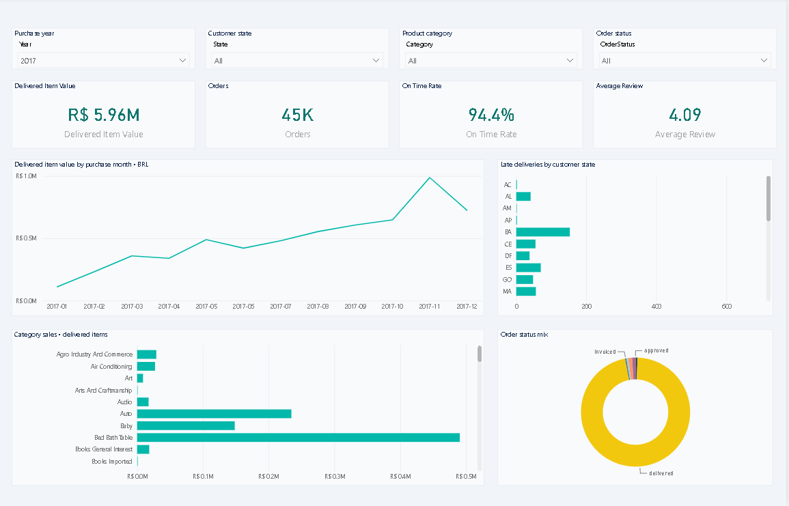
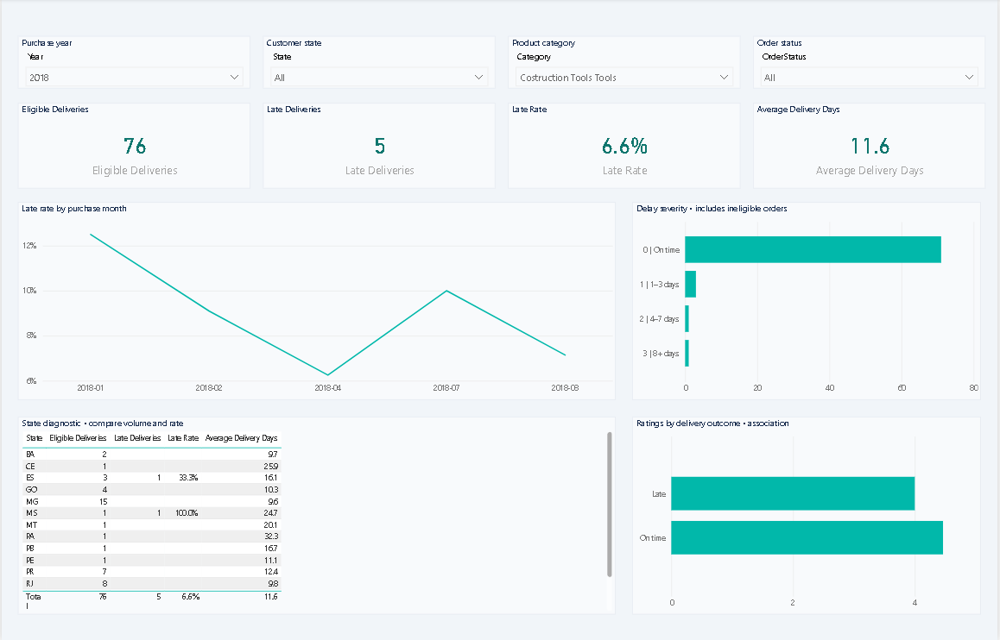
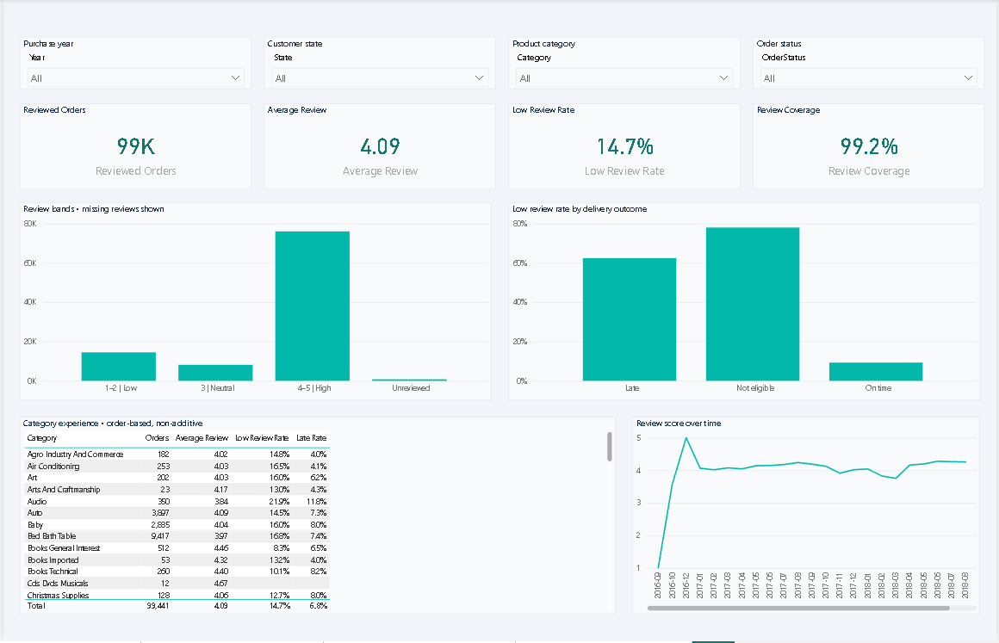

# Commerce Pulse
## Dashboard preview

### Executive overview


### Delivery diagnostics


### Customer experience


### Seller performance


[Download the Power BI report](CommercePulse_Analysis.pbix)
### Delivery Performance & Customer Experience | Power BI · SQL · Python

**Business question:** Where should an e-commerce operations team investigate delivery problems first, and how do those problems relate to customer experience?

A historical portfolio case study built in 2026 using Olist's Brazilian marketplace data from **2016-09-04 to 2018-10-17**. Currency: BRL. No claim that the data represents current market conditions.

## Start here
## Open the dashboard

1. Download CommercePulse_Analysis.pbix using the link above.
2. Open it in Power BI Desktop on Windows.
3. Explore the four pages and use the year, state, category and status filters.

The saved report includes imported data. Refreshing requires downloading
the source dataset and rebuilding the CSVs using the instructions below,
then updating the DataFolder parameter.

**Validation:** Data integrity and report schema checks passed. The report was opened and refreshed in Power BI Desktop, and manual page and filter checks found no errors.

## Four report pages
| Page | Decision supported | Interactions authored |
|---|---|---|
| Executive overview | Track delivered item value, order volume and service quality | Year, state, category and status slicers; selectable chart categories |
| Delivery diagnostics | Compare delay volume, delay rate and severity | Monthly trends, state diagnostic table, delivery outcome selection |
| Customer experience | Locate low ratings and missing review coverage | Review bands, outcome comparison, category experience table |
| Seller performance | Prioritize seller investigation without overreacting to tiny samples | Seller table, seller-state comparisons, priority metric |

## Observed results (full dataset, Python reference)
- Orders: **99,441**; orders without items: **775**.
- Delivered item value: **R$ 13,221,498.11**, excluding freight. This is merchandise value, not Olist platform revenue or profit.
- Eligible deliveries: **96,470**; late deliveries: **6,534** (**6.77%**).
- Mean delivery time: **12.56 days**.
- Mean rating: late **2.27/5**, on time **4.29/5**.

These are descriptive associations. Category, distance, product issues and selection into reviewing may confound the observed relationship. No causal uplift, savings, profit or retention improvement is claimed.

## Recommendations to investigate
1. Use absolute late-order volume to prioritize states, then inspect rates and sample sizes.
2. Review sellers with at least 100 eligible deliveries and substantial late-order counts. The threshold is an analyst choice, not an Olist SLA. Order delivery is shared across all sellers in a multi-seller order, so this is an investigation queue, not a seller fault score.
3. Examine promised delivery dates and shipping handoffs for priority cohorts. Validate with operations data before changing promises.
4. If testing proactive delay communication, define a randomized trial and measure complaint rate, satisfaction and contact volume. This dataset cannot estimate the intervention's effect.

## Engineering choices
- Orders: one row per order. Items: one row per order item.
- Payments aggregated before joining; latest answered review retained with deterministic review-ID tie-breaker.
- Single-direction relationships avoid ambiguous filter paths.
- Item-side category/seller selections scope order-based measures using `TREATAS`; counts are non-additive across categories or sellers.
- Delivered orders with valid actual/estimated dates and nonnegative transit time form the delay denominator.
- Lateness compares calendar dates, so delivery later in the day on the promised date counts as on time.
- Unreviewed orders are excluded from review means and low-review rates, and shown explicitly as a band.
- No cost data: no profit analysis. Customer repeat behavior and churn are not inferred from an incomplete observation window.

## Repository map
`powerbi/` native project and DAX; `data/` curated CSVs and local SQLite database; `sql/` executable analyses; `scripts/` reproducible transformation; `docs/` definitions, findings and validation; `assets/` theme.

## Reproduce
Download and extract the original CSVs from https://www.kaggle.com/datasets/olistbr/brazilian-ecommerce into a separate `source-data` folder. Install `requirements.txt`, then run:
```bash
python scripts/build_project.py --source source-data --output rebuilt
```
This rebuilds the curated data, model and report definitions. Documentation supplied in this package is maintained separately. SQL uses SQLite and can run against `data/commerce-pulse.sqlite`. The database is excluded from Git by default; CSV files are sufficient for Power BI.

## Source and attribution
Dataset: **Brazilian E-Commerce Public Dataset by Olist**, published by Olist on Kaggle. Public-source historical data, not Sameer's employer data. See `docs/data-source.md` for source and redistribution terms. Project code is MIT licensed; dataset rights remain with the original publisher.

## Presenting this project honestly
Use the included interview guide to explain the model and the findings in your own words. Claim only skills you can demonstrate. Add actual Desktop screenshots after validation; do not present a design reference as a working report screenshot.
